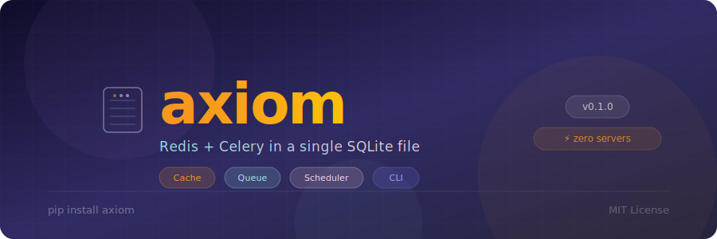
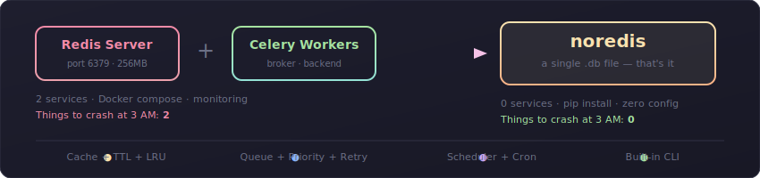
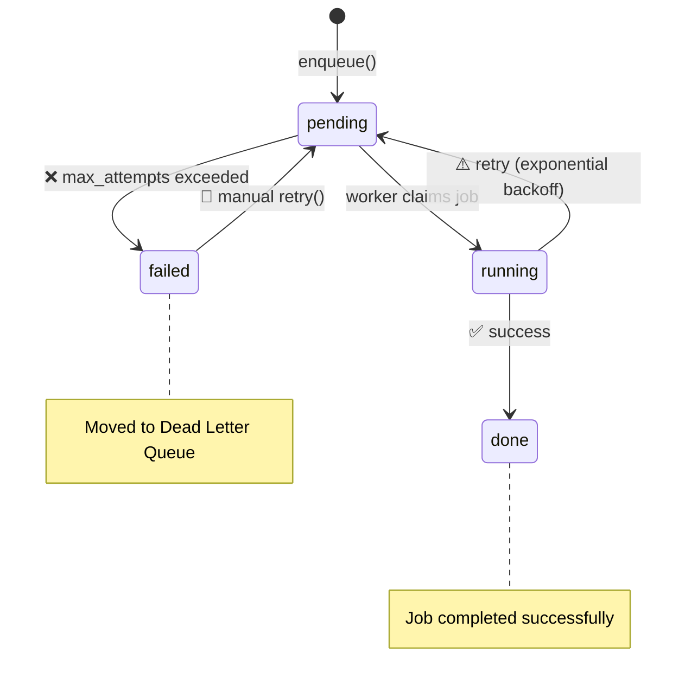
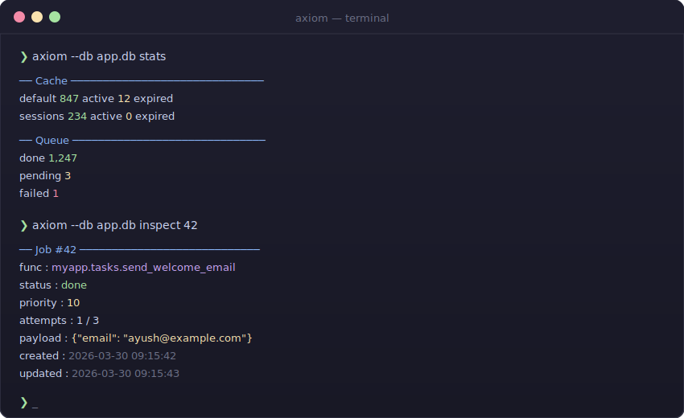
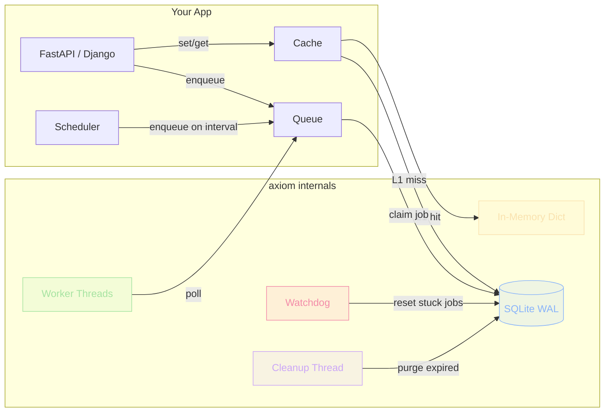

<p align="center">
  
</p>

<p align="center">
  <a href="https://github.com/Ayush-e4/axiom/actions/workflows/test.yml"></a>
  <a href="https://pypi.org/project/axiom/"></a>
  <a href="https://pypi.org/project/axiom/"></a>
  <a href="https://github.com/Ayush-e4/axiom/blob/main/LICENSE"></a>
  <a href="https://github.com/Ayush-e4/axiom"></a>
</p>

<p align="center">
  <b>Cache · Queue · Scheduler — all in a single SQLite file.</b><br>
  <sub>Zero servers. Zero config. Zero dependencies. Just <code>pip install axiom</code>.</sub>
</p>

---

<br>

## 🤔 The Problem

Every FastAPI / Django project eventually needs **caching** and **background jobs**.

The standard answer? Spin up **Redis** + **Celery**. That's 2 extra services, Docker containers, config files, and things to crash at 3 AM.

**For most apps serving < 1,000 users, that's massive overkill.**

<br>

<p align="center">
  
</p>

<br>

## ✨ Features

<table>
<tr>
<td width="50%">

### 🗄️ Cache
- Key-value store with **TTL**
- **L1 in-memory** layer (hot keys never hit disk)
- **LRU eviction** at configurable max size
- **Namespace** isolation
- Background expired-key cleanup

</td>
<td width="50%">

### 📮 Queue
- Background job execution with **thread pool**
- **Priority** ordering
- **Delayed** jobs (`run_at` / `delay`)
- **Retry** with exponential backoff
- **Dead letter queue** for permanent failures

</td>
</tr>
<tr>
<td width="50%">

### ⏰ Scheduler
- `every(seconds=N)` — fixed interval
- `daily(hour=H, minute=M)` — daily at time
- Runs as lightweight background thread
- Plugs directly into the Queue

</td>
<td width="50%">

### 🛠️ CLI
- `axiom stats` — cache & queue overview
- `axiom jobs` — list/filter jobs by status
- `axiom inspect <id>` — deep-dive a job
- `axiom retry` — retry failed jobs
- `axiom purge` — clean up done/failed

</td>
</tr>
</table>

<br>

## 🚀 Quick Start

```bash
pip install axiom
```

> **Requirements:** Python 3.10+ · No external dependencies — just the standard library.

```python
from axiom import Cache, Queue, Scheduler, task

cache = Cache("app.db")
queue = Queue("app.db")

# ── Cache ──────────────────────────────────────────
cache.set("user:1", {"name": "Ayush"}, ttl=300)
cache.get("user:1")          # → {"name": "Ayush"}
cache.ttl("user:1")          # → 298.7
cache.delete("user:1")

# Namespaces
sessions = cache.namespace_scope("sessions")
sessions.set("tok:abc", {"uid": 99})

# ── Queue ──────────────────────────────────────────
@task
def send_email(payload):
    print(f"Sending to {payload['to']}")

queue.start_worker(concurrency=2)

queue.enqueue(send_email, {"to": "x@y.com"})                  # run now
queue.enqueue(send_email, {"to": "x@y.com"}, delay=30)        # run in 30s
queue.enqueue(send_email, {"to": "x@y.com"}, priority=10)     # run first
queue.enqueue(send_email, {"to": "x@y.com"}, max_attempts=5)  # retry up to 5×

# ── Scheduler ──────────────────────────────────────
@task
def send_newsletter(payload):
    ...

scheduler = Scheduler(queue)
scheduler.every(send_newsletter, seconds=3600)      # every hour
scheduler.daily(send_newsletter, hour=9, minute=0)  # every day at 9 AM
scheduler.start()
```

<br>

## ⚡ FastAPI Integration

```python
from fastapi import FastAPI, HTTPException
from axiom import Cache, Queue, task

app = FastAPI()
cache = Cache("app.db")
queue = Queue("app.db")
queue.start_worker(concurrency=4)

@task
def send_welcome(payload):
    send_email(payload["to"], "Welcome!")

@app.get("/user/{user_id}")
def get_user(user_id: str):
    # Check cache first
    cached = cache.get(f"user:{user_id}")
    if cached:
        return {"source": "cache", **cached}

    # Fetch from DB and cache for 5 minutes
    user = db.fetch(user_id)
    cache.set(f"user:{user_id}", user, ttl=300)
    return user

@app.post("/register")
def register(email: str):
    user = db.create(email)
    queue.enqueue(send_welcome, {"to": email})  # non-blocking
    return user
```

> 📁 See [`examples/`](examples/) for complete [FastAPI](examples/fastapi_example.py) and [Django](examples/django_example.py) integration examples.

<br>

## 🔄 Job Lifecycle



Inspect and retry dead-lettered jobs:

```python
queue.dead_letters()        # list permanently failed jobs
queue.retry(job_id)         # manually push back to pending
queue.stats()               # {"done": 1247, "pending": 3, "failed": 1}
```

<br>

## 🖥️ CLI Dashboard

<p align="center">
  
</p>

```bash
axiom --db app.db stats            # cache & queue overview
axiom --db app.db jobs -s failed   # list failed jobs with traces
axiom --db app.db inspect 42       # deep-dive into any job
axiom --db app.db retry --all      # retry all dead-lettered jobs
axiom --db app.db purge -y         # delete completed & failed jobs
axiom --db app.db flush            # clear all cache entries
```

<br>

## 🏗️ Architecture



<br>

<details>
<summary><b>🔬 How it works under the hood</b></summary>

<br>

| Mechanism | What it does |
|---|---|
| **WAL mode** | SQLite's write-ahead log enables concurrent reads while writing |
| **L1 memory cache** | Hot keys are served from a Python dict — zero disk I/O |
| **LRU eviction** | When L1 exceeds `max_size`, the oldest half is dropped |
| **Atomic job claiming** | `SELECT` + `UPDATE` inside a Python lock — no two workers grab the same job |
| **Exponential backoff** | Failed jobs retry at `2^attempts` seconds (2s → 4s → 8s → …) |
| **Watchdog thread** | Every 60s, resets jobs stuck in `running` for >5 min (crash recovery) |
| **TTL cleanup** | Background thread purges expired cache keys every 5 min |
| **`PRAGMA` tuning** | `synchronous=NORMAL`, `cache_size=10000`, `temp_store=MEMORY`, `busy_timeout=5000` |

</details>

<br>

## 🚫 When NOT to Use This

| Scenario | Use instead |
|---|---|
| Multiple servers hitting the same queue | Redis + Celery |
| >10k writes/second | Redis |
| Pub/sub fan-out to many consumers | Redis |
| Distributed across data centers | Redis Cluster |

> **For everything else** — one server, reasonable load, a few hundred users — **axiom is fine forever.**

<br>

## 📊 Comparison

```
┌──────────────────────────────────────────────────────┐
│                   Setup Complexity                    │
├──────────────────────────────────────────────────────┤
│                                                      │
│  Redis + Celery  ████████████████████████████  100%  │
│                  Docker, broker, backend,            │
│                  monitoring, config files             │
│                                                      │
│  axiom           ██                            5%    │
│                  pip install axiom                    │
│                                                      │
└──────────────────────────────────────────────────────┘
```

<br>

## 🤝 Contributing

Contributions are welcome! Please read [CONTRIBUTING.md](CONTRIBUTING.md) before submitting a PR.

```bash
git clone https://github.com/Ayush-e4/axiom.git
cd axiom
pip install -e ".[dev]"
pytest tests/
```

<br>

## 📄 License

MIT — see [LICENSE](LICENSE) for details.

---

<p align="center">
  <sub>Built with 🧡 and a single <code>.db</code> file.</sub>
</p>
